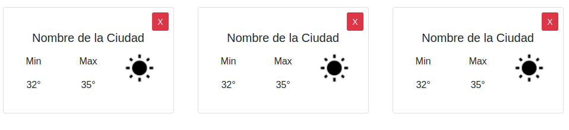

<<<<<<< HEAD
## Henry Weather


### Ejercitación

En este `homework` vamos a utilizar `react-router` para poder tener más de una ruta en nuestra **SPA**.

Vamos a utilizar el código que hicimos en el `homework` anterior. Si no lo terminaste, no te preocupes, en `src` dejamos todo el código para tener el proyecto funcionando.  
__IMPORTANTE__ : Reutilicen también la `apiKey` que crearon en la homework anterior  

Cuando terminemos este `homework`, vamos a tener tres rutas que podremos navegar:
 - **"/"**: El home, acá vamos a ver lo mismo que veiamos.
 - **"/ciudad/{ciudadId}/"**: en esta ruta, vamos a tener información más detallada sobre el clima de una ciudad en particular, notese que usamos el ID de una ciudad para identificarla y no el nombre.
 - **"/about"**: Tu oportunidad de poner tu nombre y explicar un poco de que va la `weatherApp`.


#### Comenzamos el Enrutado de nuestra aplicacion.

Vamos a Comenzar creando los componentes que nos faltan en nuestra carpeta componentes. Creamos `About.jsx` y `Ciudad.jsx` con sus respectivos archivos `.css` para el estilado dentro de la carpeta `components`.

#### Rutas Dinámicas

Cómo sabemos, `react-router` nos da la posibilidad de crear rutas dinámicas, y podemos decidir qué Componentes queremos que aparezcan en qué rutas.
Para nuestro ejercicio nosotros queremos ver lo siguiente:

- `<Nav />` tiene que aparecer en todas las rutas.
- `<Cards />` debe aparecer sólo en la ruta `/`.
- `<About />` debe aparecer sólo la ruta `/about`.
- `<Cuidad />` debe aparecer sólo en la ruta `/ciudad/{ciudadId}`

#### Importamos React-Router

Vamos a tener que instalar `react-router-dom`. Para eso hacemos:

```shell
npm install --save react-router-dom
```
Cómo sabemos, lo primero que necesitamos es elegir un Wrapper.

Para ello debemos importar `BrowserRouter` del paquete recién agregado `react-router-dom`:

```js
// index.js
...
import { BrowserRouter } from 'react-router-dom';
...
```

Luego vamos a usar `<BrowserRouter/> `, por lo tanto, debemos envolver toda nuestra applicación con este Componente:

```js
// index.js

...

ReactDOM.render(
  <BrowserRouter>
    <App />
  </BrowserRouter>,
  document.getElementById('root')
);
```
#### Modificando el NavBar

Ahora que ya hemos preparado nuestra App para usar router, vamos a agregar los links necesarios en nuestro `<Nav />`. Para ello notar que es necesario primero importar `Link` desde `react-router-dom`. (Recordar de importar el componente About para poder utilizarlo)

```js
//Nav.js
import { Link } from 'react-router-dom';

function Nav({onSearch}) {
  return (
    <nav className="navbar navbar-dark bg-dark">
      <Link to='/'>
        <span className="navbar-brand">
          
          Henry - Weather App
        </span>
      </Link>
      <Link to='/about'>
        <span>About</span>
      </Link>
        <SearchBar
          onSearch={onSearch}
        />
    </nav>
=======
<<<<<<< HEAD
## React Hooks Timer App

Haremos una App sencilla, utilizando los nuevos features de React, __Hooks__, que nos permiten el uso de manejos de estados y llevar a cabo efectos secundarios en nuestros componentes funcionales.

Nuestra App sera un Contador y Cuenta regresiva. Podremos cambiar entre ambos y escribir una cantidad de segundos para la cuentra regresiva.

Tendremos un solo componente en donde manejaremos los estados y nuestra UI. Ya tendras creado el componente `Timer.js` y `Timer.css`. Los estilos ya estarán en los files iniciales.

Comencemos:

### Paso 1

Ejecutamos `npm install` en la consola para instalar las dependencias, una vez instalamos inicializamos el proyecto con `npm start`. Se iniciara en `http://localhost:3000/`.

### Paso 2

Comenzamos a crear nuestro HTML que mostrara nuestro componente.
=======
<<<<<<< HEAD
# Redux OMDB APP

En este ejercicio vamos a crear una APP que utilice la API de [OMDB](http://www.omdbapi.com/). Vamos a crear nuestra app utilizando __REACT__ y __REDUX__.

> Vamos a necesitar una APIKEY ya que la API de OMDB es paga.

Para eso deben ir a la página de OMDB a crearse una cuenta.  
1 - Ir a la página de [creación de apiKey]((http://www.omdbapi.com/apikey.aspx)) y rellenar el formulario  
2 - Una vez completado el formulario, les llegará un email a con la `apiKey` que utilizarán para acceder a la api de OMDB  
3 - Listo! ya pueden utilizar la `apiKey` creada para resolver la homework

Con tu App podremos:

* Buscar películas y listarlas.
* Poder ver todos los detalles de una película en particular.
* Poder agregar las películas a tu lista de favoritos.
* Poder sacar películas de tu lista de favoritos.


### Comenzamos

Para poder comenzar tenemos que instalar las dependencias que utilizaremos. Tendran en el `package.json` ya las dependencias. Ahora hacemos:

```javascript
npm install
```
Dentro de nuestra carpeta `components` tendremos subcarpetas con nuestros nuestro archivo.js y .css para tener mas acomodado nuestro codigo.
En la carpeta `components` tenemos 4 subcarpetas: `Buscador`. `Favorites`, `Movie`, `NavBar`. Y en cada una crearemos sus respectivos archivos .js y .css.
`NavBar.js` sera nuestro Header que nos permitira navegar por nuestras rutas.
`Buscador.js` sera nuestro Home, en donde buscaremos peliculas (llamando a la API) y las mostraremos en forma de lista.
En `Favorites.js` mostraremos la lista de peliculas a las cuales seleccionamos como Favoritas.
Y por ultimo en `Movie.js` sera nuestro compente en donde mostraremos una pelicula en detalle. Accedemos a este componente haciendo click dentro de nuestro buscador o en nuestras favoritas.

### Creamos nuestras Actions

En nuestro archivo `index.js` en nuestra carpeta actions. Por ahora vamos a crear 4 actions. Una para hacer la request a la API y traer todas las peliculas `getMovies`,otra para traer los detalles de la pelicula especifica `getMovieDetail`, a otra para agregarlas como Favoritas `addMovieFavorite` y otra para eliminarla de favoritas `removeMovieFavorite`.

> Abajo tienes un par de ejemplos, para las dos que faltan tienes que investigar y hacerlo por tu propia cuenta. La api que usamos es `http://www.omdbapi.com/`

> Para obtener alguna película a partir de su ID pueden usar el endpoint: http://www.omdbapi.com/?apikey=20dac387&i={idMovie}

```javascript
export function addMovieFavorite(payload) {
  return { type: "ADD_MOVIE_FAVORITE", payload };
}

export function getMovies(titulo) {
  return function(dispatch) {
    return fetch("http://www.omdbapi.com/?apikey=tuApiKey&s=" + titulo)
      .then(response => response.json())
      .then(json => {
        dispatch({ type: "GET_MOVIES", payload: json });
      });
  };
}

```
Cada accion devuelve un objecto, la primera key de este objeto es el `type`, su valor lo ponemos nosotros, por convencion se usan mayusculas y guion bajo `_` para separar. Como segundo argumento recibe un `payload`, que son datos que puede llevar que usaremos en nuestro reducer para actualizar el estado. En `addMovieFavorite` el payload que pasaremos cuando hagamos un dispatch de esa action sera el nombre de la Pelicula.En `removeMovieFavorite`,nuestro payload sera la pelicula a eliminar. En `getMovies`, nuestro payload sera el objeto que recibamos de nuestra request. En `getMovieDetail`, el payload sera el objeto con los detalles de la pelicula que seleccionamos.

### Creamos nuestro Reducer

Vamos al archivo `index.js` en nuestra carpeta reducers. Como vimos, un reducer es simplemente una funcion que recibe 2 parametros: state y action. Y depende la `action` que reciba nos devuelve el estado actualizado. Al comienzo del archivo creamos nuestro estado inicial. Lo llamamos `initialState`:

```javascript
const initialState = {
  moviesFavourites: [],
  moviesLoaded: [],
  movieDetail: {}
};
```

Tienes que crear los 4 reducers para las 4 acciones que creamos anteriormente que son:`getMovies`, `getMovieDetail`, `removeMovieFavorite`,`addMovieFavorite`

> Aca abajo le dejamos dos ejemplos, vas a tener que crear los dos restantes

```javascript
function rootReducer(state = initialState, action) {
  if (action.type === "ADD_MOVIE_FAVORITE") {
      return {
        ...state,
        moviesFavourites: state.moviesFavourites.concat(action.payload)
      }
  }
  if (action.type === "GET_MOVIES") {
      return {
        ...state,
        moviesLoaded: action.payload.Search
      };
  }
  return state;
}

export default rootReducer;
```

Ya tenemos la base de nuestro reducer. Como sabemos el `initialState` es inmutable, por eso a la hora del return, hacemos una copia de este, con sintaxis de ES6 (spread operator) otra opcion seria usar `Object.assign({}, state, ...)`, y nos devuelve nuestro `state` actualizado. Exportamos el reducer para poder usarlo en nuestro store. Para entenderlo mejor pueden leer [aca](https://redux.js.org/recipes/structuring-reducers/immutable-update-patterns).


### Armamos nuestro store

Ahora pasamos a crear nuestro Store Global que tendra todo nuestro State. Vamos a nuestro archivo `index.js` en nuestra carpeta store, tenemos que importar `CreateStore` de 'redux', por ahora nos deberia quedar asi:

```javascript
import { createStore } from "redux";

const store = createStore();

export default store;
```
La funciton `createStore` recibe argumentos. Primero le pasaremos nuestro `rootReducer` y despues nuestro Middleware para poder hacer peticiones asincronas en nuestro codigo.

### Conectamos el Store con nuestro rootReducer y Middleware

Ya tenemos nuestro Reducer y nuestras actions. Entonces terminamos de conectar nuestro store, para esto importamos `applyMiddleware` de 'redux', `thunk` de la libreria 'redux-thunk' y nuestro Reducer. Pasamos como parametros en `createStore` nuestro rootReducer y applyMiddleware, a esta le pasamos nuestro middleware `thunk`.
Puedes investigar sobre `thunk` en  [aca](https://github.com/reduxjs/redux-thunk).
Usamos un Middleware para poder hacer peticiones AJAX sin problemas. Nos quedaria algo asi:

```javascript
const store = createStore(
  rootReducer,
  applyMiddleware(thunk)
);

export default store;
```

### Conectamos nuestro Store con nuestra App de React

Es hora de conectar todo. Para eso necesitaremos de un componente que nos brinda la libreria 'react-redux', que se llama `Provider`. En nuestro Provider llamamos a nuestro store, y con este envolvemos a toda nuestra App, para tener acceso a nuestro store desde cualquier componente hijo.

```javascript
//root index.js

ReactDOM.render(
  <Provider store={store}>
    <BrowserRouter>
      <App />
    </BrowserRouter>
  </Provider>,
  document.getElementById('root')
);
```
Ya tenemos nuestro STORE conectado con nuestra App!

### Conectamos nuestro componente con nuestro Store

Usamos las funciones `mapStateToProps` y `mapDispatchToProps` dentro de nuestros componentes. La primera nos permite traer nuestro state global como props a nuestro componente, y la segunda nos permite hacer el `dispatch` de nuestras actions al store. Y para terminar de conectar nuestro componente con el store global usamos una HoC ( High Order Component ) que importamos de la libreria 'react-redux' que se llama `connect`. En nuestro componente `Buscador.js` nos deberia quedar algo asi:

```javascript
//Buscador.js

function mapStateToProps(state) {
  return {
    movies: state.moviesLoaded
  };
}

function mapDispatchToProps(dispatch) {
  return {
    addMovieFavorite: movie => dispatch(addMovieFavorite(movie)),
    getMovies: title => dispatch(getMovies(title))
  };
}

export default connect(
  mapStateToProps,
  mapDispatchToProps
)(Buscador);
```

Pasamos a explicar un poco que estamos haciendo. `mapStateToProps` recibe como parametro `state` y nos devuelvo un objecto con parte del state que queremos, en este caso usamos la key 'movies' (accedemos a ella en nuestro componente como this.props.movies) y su value es la parte del estado que queremos traer, `moviesLoaded` en este caso.
`mapDispatchToProps` recibe como parametro una funcion, la llamamos dispatch, y nos devuelve un objecto, con las acciones que queremos enviar a nuestro store. Los nombres son arbitrarios, son los que usaremos para acceder a estos en nuestro componentes via props. Cada funcion nos devuelve la funcion dispatch que recibe como parametro la action que queremos enviar al store, en nuestro caso son `addMovieFavorite` y `getMovies` que tenemos en nuestra carpeta `actions`. Los parametros que recibe cada function son los payloads que usamos en nuestra action.

### Dispatch una accion desde nuestro componente

Los siguiente que haremos en nuestro componente `Buscador.js` es agragar la accion `getMovies` pasandole el valor que guardamos en nuestro estado con el valor title en nuestra funcion `handleSubmit` para tener una referencia del valor ingresado en el input o usando el evento `onChange` en el input y guardando el valor en el state del componente.

### Obtener y mostrar nuestro cambio de State

Una vez que hacemos el dispatch, ya tenemos nuestro state en nuestro Store, en `mapStateToProps` ya traemos el state que updeteamos en nuestro form. Ahora tenemos un array de objetos con las peliculas que nos trajo nuestra request a la API. El siguiente paso seria mapear ese array y hacer un return con el Nombre de la pelicula y un boton el cual tendra un evento de `onClick`. Este evento sera `addMovieFavorite`, que tenemos en nuestra `mapDispatchToProps` para guardar peliculas como Favoritas. Ej:

<div style="text-align:center"></div><br>

 En el caso de `addMovieFavorite` como parametro le pasamos un object con el titulo de la Pelicula y su ID, que mas adelante utilizaremos en el componente Favorites. Ej:

```javascript
//Recordamos que nuestro button se encuentra dentro del metodo map

<button onClick={() => this.props.addMovie({title: movie.Title, id: movie.imdbID})}>Fav</button>
```

Hasta ahora tenemos nuestro componente Home, en donde podemos buscar peliculas, guardarlas en nuestro state global, y mostrarlas. Las peliculas que nos trae la request la estamos guardando en `moviesLoaded` y las que seleccionamos como favoritas en `moviesFavourites`. El siguiente paso sera comenzar a hacer el enrutado para mostrar nuestras pelis Favoritas.

### En el componente Favorites

 Este sera un componente de clase, que llame a `mapStateToProps` y `mapDispatchToProps` como hicimos anteriormente. `mapStateToProps` nos traera simplemente `state.movies` y  `mapDispatchToProps` tendra un dispatch para eliminar peliculas de favoritos, que es el que creamos anteriormente llamado `removeMovieFavorite`. Ya tenemos lo que necesitamos para mostrar nuestras pelis favoritas y nuestro evento para eliminarlas. Como hicimos en `Buscador.js`, mapeamos nuestras peliculas, y hacemos un return con el nombre y un boton que tendra el evento para eliminarlas. Ej:

<div style="text-align:center"></div><br>

Por ahora nos deberia quedar algo asi,

### En el componente Movie

 En nuestros componentes `Favorites.js` y `Buscador.js` veremos que cuando mapeamos nuestro array con peliculas, cada pelicula tiene un `imdbID` usaremos ese ID como parametro, entonces en donde renderizamos el Titulo de la Pelicula, lo envolvemos en un Link y le pasamos como parametro ese ID que recibimos. Algo asi:

```javascript
//Buscador.js

<Link to={`/movie/${movie.imdbID}`}>
  {movie.Title}
</Link>
```

Ahora cuando hagamos click en alguna pelicula nos deberia llevar a la ruta `/movie/{movie-id}`. En nuestro componente Movie tenemos que usar ese parametro para usarlo en nuestra `getMovieDetail` function. Podemos acceder a este valor gracias a las `props` que nos da `react-router` de la siguientes maneras:

```javascript
// usando destructuring
const { match: { params: { id }}} = this.props;

// manera convencional
const movieId = this.props.match.params.id;
```
Llamamos a la funcion `getMovieDetail` y le pasamos nuestro ID todo dentro de nuestro `componentDidMount`. Una vez obtenido los datos tendriamos que tenerlos en `this.props.movieDetail` (obtenidos desde nuestro mapStateToProps y guardado en nuestro initalState). Y por ultimo mostramos detalles de la pelicula por ej: Titulo, Año, Rating, Plot, Premios, Genero, etc... Ej:

## Punto Extra:

Para mejorar la experiencia del usuario, cuando se presione el link para ver el detalle de una película, mostrar un texto o imagen que indique que se está "Cargando" la información, hasta que llegue el response del servidor y recién ahí, mostrar su detalle.

<div style="text-align:center"></div><br>

Con esto tendriamos una App integrado con React Redux!
=======
<<<<<<< HEAD
## Henry Weather Card

### Ejercicio

En este homework, vamos a crear una serie de Componentes de React que luego vamos a usar en el próximo homework.

> **Nota**: Todos los Componentes que hagamos en este homework son `Puros` o `Funcionales`, por lo tanto, ninguno tiene estado, simplemente reciben datos por props.
>
> No te preocupes por el estilo de los componentes. En el homework de mañana vamos a darle Estilos.

En la carpeta `src` vas a encontrar ya el esqueleto del proyecto React, y los archivos donde deberás codear cada Componente.

Sabemos que los Componentes de React tiene que cumplir el principio de una sóla responsabilidad, es decir que cada Componente debé cumplir una sóla tarea bien definida. Los Componentes que vamos a codear son:


#### Weather Card (`components/Card.js`)

Esta tarjeta va a mostrar el nombre de una ciudad, con su temperatura máxima y mínima, y con una imagen que representa el estado del clima (soleado, nublado, etc..), además cuando el usuario haga click en la X de cerrar, se invocará una función que tambien viene como props.


Este Componente va a recibir las siguientes props:
- **max**: Temperatura Máxima.
- **min**: Temperatura Mínima.
- **name**: Nombre de la ciudad.
- **img**: nombre de la imagen que se debe mostrar.
- **onClose**: recibe una función que se va a ejecutar cuando el usuario haga click en el botón de cerrar.

Todos estos datos van a venir de una API de clima, pero por ahora no nos interesa esa parte. Nosotros te vamos a dar datos de prueba para que puedas ver tu componente funcionando.

__IMPORTANTE:__ Para poder obtener la imagen correspondiente desde la API del clima deben utilizar la siguiente URL `http://openweathermap.org/img/wn/${img}@2x.png` donde img debería ser el código del icono asociado a la imagen que recibe como prop. Por ejemplo: http://openweathermap.org/img/wn/02d@2x.png

#### Cards (`components/Cards.js`)

Este Componente nos va a servir para renderizar muchos Componentes `Cards`. Básicamente, este componente va a recibir un arreglo de `ciudades` (con todos sus datos), y va a crear un componente `Card` por cada ciudad, pasandole las props correspondientes.



> Tip: Podés usar la función `map` y devolver un componente `Card` por cada elemento del arreglo. [Acá](https://es.reactjs.org/docs/lists-and-keys.html#rendering-multiple-components) un ejemplo de la documentación de React.

#### Barra de búsqueda (`components/SearchBar.js`)

Este componente se va a utilizarse para luego poder encontrar las ciudades sobre las cuales se desee ver el clima actual.


Este Componente recibe por props una función `onSearch` que recibe un parámetro (que será el nombre de la ciudad tomado desde el input pero de momento pueden pasarle uno cualquiera ya que aún no estamos utilizando estados dentro del componente). La función `onSearch` se debe ejecutar cuando se haga click en el botón `Agregar`.

### Instrucciones para correr el proyecto

Desde la carpeta `homework` se pueden ejecutar los siguientes comandos:

#### `npm install`

Instala todas las dependecias necesarias para correr el proyecto correctamente

#### `npm start`

Comienza a correr la aplicación de forma local por lo que se puede ver desde el navegador accediendo a
http://localhost:3000

>No es necesario volver a correr el proyecto cada vez que se realice un cambio sino que se verá automáticamente reflejando en el navegador.
=======
<<<<<<< HEAD
# React Forms

## Instrucciones para correr el proyecto

Desde la carpeta raíz `homework` se pueden ejecutar los siguientes comandos:

```shell
npm install
```

Instala todas las dependecias necesarias para correr el proyecto correctamente

```shell
npm start
```

Comienza a correr la aplicación de forma local por lo que se puede ver desde el navegador accediendo a http://localhost:3000

No es necesario volver a correr el proyecto cada vez que se realice un cambio sino que se verá automáticamente reflejando en el navegador.

## Ejecutar los Tests

```shell
npm run test
```

## Formulario Conectado/controlado

En este homework vamos a usar React Hooks para hacer un pequeño formulario conectado. También vamos a validar los inputs antes de submitear.

> Qué el formulario este conectado o controlado quiere decir que los inputs están bindeados al estado del componente, que en este caso vamos a crear usando Hooks.

### Primera Parte

En la primera parte, vamos a concentrarnos en lo que vemos en nuestra aplicación con:

`npm start`

En la segunda parte, vamos a modificar un poco de código para pasar los tests.

Nuestra tarea va a ser construir este formulario:


Va a tener:

* Username: El userName tiene que ser un email, si no, tiene que mostrar un error.
* Password: El password tiene que contener por lo menos un número, si no debe mostrar un error.

> Ya te dejamos el css necesario para que sólo te concentres en el formulario. Lo econtrarás en `index.css`

#### Estructura

Vamos a trabajar en el archivo `Form.jsx` que está en la carpeta `src`.

Comenzamos agregando el formulario per se, usando JSX. En el código vamos a crear un componente funcional llamado `Form`. Este va a retonar un `<form />`, que contenga un `<label />` y un `<input />` para el Username y el Password, respectivamente.

Te dejamos un ejemplo de cómo quedaría sólo con el input para el username.

```js
// Form.jsx

export default function  Form() {
  return (
    <form>
      <div>
        <label>Username:</label>
        <input type="text" name="username" />
      </div>
      ...
    </form>
  )
}
```

Bien, ahora debes agregar al código el input del Password, y el botón submit!

#### Estado

El siguiente paso es agregar comportamiento a nuestro componente, para eso vamos a agregarle un estado. Como vamos a usar hooks vamos a agregar:

```js
// Form.jsx

export default function Form() {
    const [username, setUsername] = React.useState('')
    const [password, setPassword] = React.useState('')

    ...
};

```

Con esto, estamos agregando estado al componente.

Genial! ahora tenemos estado, pero tenemos que *conectarlo* con el formulario. Para eso vamos a poner como `value` del input el estado correspondiente.

```js
// Form.jsx
    ...
    <form>
      <div>
        <label>Username:</label>
        <input type="text" name="username" value={username}/>
      </div>
      ...

}
```

Por ahora, el input toma el valor del estado, pero cuando se cambia el input el estado no cambia, tenemos que bindearlos!
Para eso vamos a usar el evento `onChange` del input, y le vamos a pasar las funciones `setUsername` y `setPassword`, respectivamente:

```js
// Form.jsx

export default function  Form() {
  ...

  return (
    <form>
      <div>
        <label>Username:</label>
        <input type="text" name="username" onChange={(e) => setUsername(e.target.value)} value={username} />
      </div>
      ...
    </form>
  )
}
```

Recuerden que `setUsername` y `setPassword` reciben un string que usará para actualizar el estado. Y que `onChange` ejecuta una función pasándole un `evento` como argumento, por lo tanto, tenemos que pasarle una función nueva que reciba un `evento` e invoque a `setUsername` con el valor del input, que esta en `evento.target.value`.


Si hiciste todo bien hasta acá y corres los tests, deberías pasar 6 del total!


#### Mejorando el Estado

Cuando hacemos ejercicios de este tipo tenemos que pensar lo siguiente: ¿Qué pasaría si en vez de dos inputs, tuviera diez? ¿Mi código es escalable?

Claramente la respuesta es NO, ya que debería crear un estado y una función para cada input, y rápidamente estaría repitiendo código y se volvería díficil de manejar. Ahora la siguiente pregunta es: ¿Cómo puedo mejorar el código para que sea más eficiente y escalable?

Bien, para empezar vamos a unificar el estado en un sólo objeto, donde cada input se refleje en una propiedad:

```js
// estado de Form
{
    username: '',
    password: '',
    ...
}
```

Llamaremos `input` a ese estado:

```js
// Form.jsx
...
const [input, setInput] = React.useState({
    username: '',
    password: '',
  });
...
```

Al definir un sólo estado, vamos a tener más control sobre él, pero ahora tenemos una sola funcion `setInput` que debe manejar todos los inputs.

Recordemos que el `onChange` pasa un evento a la función que le pasemos. Y dentro de ese evento tenemos `evento.target.name` y `evento.target.value`. Por lo tanto, podemos usar las nuevas features de ES6 para crear un objeto así:

```js
{
    [evento.target.name]: evento.target.value,
}
```

Entonces, si le pasamos esta función a cualquier input, podemos usar su atributo `name` para indicar el nombre de la propiedad en el estado.

Recuerden que `setInput` *pista* el estado anterior. Por lo tanto tenemos que pasarle también las propiedades viejas que tenia el estado, podemos usar el spreading de ES6:

```js
{
    ...input, // las propiedades que ya tenia input
    [evento.target.name]: evento.target.value,
}
```

Entonces, nuestra función quedaría así:

```js
// Form.jsx
...
const handleInputChange = function(e) {
    setInput({
      ...input,
      [e.target.name]: e.target.value
    });
  }
...
```

y podemos pasarsela a todos los inputs de esta forma:

```js
<form onSubmit={handleSubmit}>
      <div>
        <label>Username:</label>
        <input
          type="text" name="username" onChange={handleInputChange} value={username} />
      </div>
      <div>
     ...

```

> Ahora el valor del input estára en `input[propiedad]`, debemos cambiar eso en todos los inputs tambien!

Si corremos los tests, deberiamos estar pasando 8 de ellos!!

#### Validaciones

Ahora vamos a agregar las validaciones en nuestro form. Básicamente, cada vez que se actualize el estado queremos controlar si cada input cumple con las condiciones que pedimos.
En nuestro caso, que el username sea un mail válido, y el password contenga por lo menos un número.

Para hacer esto, necesitamos definir una función `validate` que reciba el input, y nos diga si cumple o no. Vamos a usar [Regexp](https://es.ryte.com/wiki/RegEx) para controlar los inputs.

Nuestra función `validate` va a recibir un objeto `input`, y va a retornar un objeto `errors`, donde pondrá un mensaje de error por cada input que no cumpla las condiciones, o vacio si cumple. Por ejemplo:

```js
//input
{
    username: 'toni@soyhenry.com',
    password: 'hola'
}
//errors
{
    password: 'Password is invalid'
}
```

Otro ejemplo:

```js
//input
{
    username: 'toni',
    password: ''
}
//errors
{
    username: 'Username is invalid',
    password: 'Password is required'
}
```

Te compartimos la primera mitad de la función `validate`, lo que ves en el if es una expresión regular que controlar por un mail válido (estas expresiones son comunes y podés encontrarlas en internet!).

__IMPORTANTE__: Para que funcionen correctamente los tests esta función debe ir por fuera del componente Form. Adicionalmente colocarla allí nos permitiría de ser necesario importarla en otro archivo y reutilizarla.

```js
export function validate(input) {
  let errors = {};
  if (!input.username) {
    errors.username = 'Username is required';
  } else if (!/\S+@\S+\.\S+/.test(input.username)) {
    errors.username = 'Username is invalid';
  }
  ...

  return errors;
};

```

Es tu tarea agregar código para que controle por el password. Cómo ayuda te dejamos la expresión regular que controla que un texto tenga un número por lo menos:

`(!/(?=.*[0-9])/.test(input.password))`

Bien, ahora tenemos que mantener en el estado los errores!

Vamos a crear un nuevo estado, donde mantenemos un objeto con los errores:

```js
...
const [errors, setErrors] = React.useState({});
...
```

Por último, tenemos que agregar el control de errores durante el `handleInputChange`:

```js
setErrors(validate({
       ...input,
       [e.target.name]: e.target.value
     }));
```

Donde pondrías esa porción de código?...


Hasta acá deberías tener 12 tests pasando!!!

#### Informando los errores

Por último, vamos a informar a los usuarios que hay errores en los inputs!
Para eso vamos a agregar dos cosas:

- Una clase `danger` al input que le da bordes rojos.
- un `<p>` que contenga el mensaje del error debajo del input.

```js
...
<div>
    <label>Username:</label>
    <input className={errors.username && 'danger'}
      type="text" name="username" onChange={handleInputChange} value={input.username} />
    {errors.username && (
      <p className="danger">{errors.username}</p>
    )}
</div>
...
```

Agregá lo mismo para password!

Si llegaste hasta acá ya deberías pasar todos los tests!
=======


<table class="hide" width="100%" style='table-layout:fixed;'>
  <tr>
   <td>
    <a href="https://airtable.com/shrHsDa2eamWqLAre?prefill_clase=08-React-Estado-LifeCycle">
   
   <br>
   Hacé click acá para dejar tu feedback sobre esta clase.
    </a>
   </td>
              <td>
      <a href="https://quiz.soyhenry.com/evaluation/new/606df913656c8d23c2e60e99">
        
        <br>
        Hacé click acá completar el quiz teórico de esta lecture.
      </a>
   </td>
  </tr>
</table>

# React Estado LifeCycle

## La mejor manera: Webpack

Cuando empiezas a trabajar en un proyecto la manera anterior de incluir React no es la mejor, de hecho no puede escalar. Cuando tenemos muchas lineas de código en un sólo archivo, o muchos archivos chicos de Js, el hecho de tener que juntar todo se empieza a complicar. Por suerte, desde hace varios años existen herramientas que nos van a automatizar este proceso, haciendo que todo el workflow sea óptimo y sobre todo mantenible.

Algunas tareas de las que se encargan estos gestores de proceso pueden ser:

* Juntar código de varios archivos en uno sólo.
* Transpilar código. Por ejemplo, de CoffeeScript, o TypeScript a Javascript.
* Minificar código.
* Concatenar archivos.
* Correr los tests automáticamente.
* etc...

> Existen varios gestores de procesos buenos y populares, los más usados son: [Grunt](http://gruntjs.com/), [Gulp!](http://gulpjs.com/) y [Webpack](http://webpack.github.io/). Nosotros vamos a usar _Webpack_, pero podrían hacer lo mismo con los otros.

-----

Ahora también se utiliza el concepto de __módulos__ en el frontend, para lograrlo se utilizan librerías como [Browserify]() o [CommonJS](). Básicamente en vez de incluir librerías usando HTML, lo hacemos en el mismo JS, después estas librerías que mencionamos se encarga de incluir realmente el código necesario para que funcione.

Un ejemplo en el frontend se vería algo así:

```javascript
//algunModulo.js
module.exports.doSomething = function() {
  return 'foo';
};
//algunOtroModulo.js
const someModule = require('someModule');
module.exports.doSomething = function() {
  return someModule.doSomething() + 'bar';
};
```

-----

Vamos a empezar instalando y configurando Webpack. Voy a aclarar al principio que Webpack es una herramienta muy poderosa, por ende compleja, y lamentablemente su documentación no es la mejor. Por lo tanto, nos va a parecer complejo al principio, pero rápidamente nos vamos a encariñar con todas las cosas que podemos hacer con Webpack.

```shell
npm i -D webpack webpack-cli
```

Como dijimos, Webpack es una herramienta que va a aplicar ciertas _transformaciones_ a nuestro código, por ende para funcionar webpack necesita saber:

1. Conocer el starting point de nuestra app, o el archivo javascript raíz.
2. Debe saber qué transformaciones tiene que hacer al código.
3. Tiene que saber dónde guardar el nuevo código transformado.

Todo esta información va a estar contenida en un archivo de configuración llamado `webpack.config.js`, que deberíamos crear en la raíz del directorio de nuestro proyecto. Este archivo va a ser en realidad un módulo, que va a exportar un objeto con las configuraciones de webpack, asi que podríamos empezar escribiendo lo siguiente en ese archivo:

```javascript
// dentro de webpack.config.js
module.exports = {}
```

Ahora empezemos a agregar la información que mencionamos antes, empezemos por el punto 1 : el entry point.

```javascript
module.exports = {
  entry: [
    './app/index.js'
  ]
}
```

Como ven, los entry points se definen dentro del objeto que exportamos bajo el nombre `entry`, y cuyo valor es un arreglo. Dentro de este explicito los paths de todos los archivos que sirvan como entry points de nuestra app. Por ahora vamos a escribir sólo uno.

Bien, ahora para el segundo punto, tenemos que definir qué tipo de transformaciones vamos a hacer, para esto entran en juego los `loaders`, estos son los módulos encargados de realizar tranformaciones, existen varios tipos de `loaders`, ya que la comunidad va creando nuevos a medida que surgen nuevas necesidades.

> Para usar un loader, es necesario tenerlo instalado antes. Para eso vamos a usar `npm`. Por ejemplo, si quiero usar el `loader` de babel debería hacer: `npm i -D @babel/core @babel/preset-env @babel/preset-react babel-loader`.

```javascript
module.exports = {
  entry: [
    './app/index.js'
  ],
  module: {
    loaders: [
      {test: /\.coffee$/, exclude: /node_modules/, loader: "coffee-loader"}
    ]
  },
}
```

En el ejemplo, usamos un `loader` de _coffeeScript_. Como se ve, también agreamos una propiedad llamada `module` que será un objeto dentro del cual aparecerá la propiedad `loaders` que será un arreglo de objetos. Cada objeto dentro de este arreglo representa una transformacion.
Vemos que ese objeto tiene tres propiedades: `test`, `exclude`, y `loader`. La primera hace referencia a qué archivos deberán pasar por la transformación, y recibe como valor una __expresión regular__, en nuestro ejemplo estamos diciendo que pasarán por la transformación todos los archivos terminados en `.coffee`. La segunda, `exclude` le indica a webpack qué directorios excluir, en nuestro ejemplo (y siempre lo haremos) excluimos `node_modules`, donde sabemos que no habrá código para transformar. Finalmente, en la propiedad `loader` vamos a poner el nombre del loader que queremos usar, en este caso el nombre es "coffee-loader".

> Siempre busquen los loaders que necesiten dentro del ecosistema npm.

Por último, vamos a agregar donde queremos que webpack deposite los archivos luego de la transformación:

```javascript
module.exports = {
  entry: [
    './app/index.js'
  ],
  module: {
    loaders: [
      {test: /\.coffee$/, exclude: /node_modules/, loader: "coffee-loader"}
    ]
  },
  output: {
    path: __dirname + '/dist',
    filename: 'bundle.js'
  },
}
```

Ya podrán imaginarse que quieren decir las cosas que hemos agregado ahora. Por empezar una nueva propiedad `output` que contiene un objeto, en este último vamos a especificar el nombre del archivo de salida (`filename`) y la carpeta donde queremos que se guarde (`path`).

Bien, entonces intentemos reproducir el mismo ejemplo que hicimos en el HTML, pero ahora usando este proceso. Por lo tanto, lo primero que hacemos es sacar el código escrito en React que estaba embebido en el HTML y lo pasamos a un archivo `js`. El primer cambio que tenemos que hacer es importar los módulos `react` y `react-dom` que antes requeríamos a través del tag `script`:

```javascript
import React from 'react';
import ReactDOM from 'react-dom';

class HelloWorld extends React.Component {
  render(){
    return (
      <div>
        Hola, Soy Henry!!
      </div>
    )
  }
};

function HelloWorldFunction() {
  return(
    <div>
      Hola, Soy Henry!
    </div>
  )
};
ReactDOM.render(<HelloWorld />, document.getElementById('app'));
```

Genial, ahora tenemos que construir el archivos de configuración de webpack, para que funcione con `babel`. Básicamente tenemos que transformar el código que usa EcmaScript6 y JSX a JS plano.

```javascript
// webpack.config.js

module.exports = {
  entry: [
    './app/index.js'
  ],
  output: {
    path: __dirname + '/dist',
    filename: 'bundle.js'
  },
  module: {
    rules: [
      {
        test: /\.(js|jsx)$/,
        exclude: /node_modules/,
        use: {
          loader: 'babel-loader',
          options: {
            presets: ['@babel/preset-react', '@babel/preset-env']
          }
        }
      }
    ]
  }
}
```

Por último vamos a tener que usar `npm` para instalar las dependencias:

```shell
npm install -D @babel/core @babel/preset-env @babel/preset-react babel-loader
```

```shell
npm install react react-dom --save
```

Para poder ejecutar webpack, debemos agregar dentro de `scripts` en nuestro `package.json` lo siguiente:

```javascript
"scripts": {
    "build": "webpack -w",
}
"devDependencies": {
    "@babel/core": "^7.9.0",
    "@babel/preset-env": "^7.9.0",
    "@babel/preset-react": "^7.9.4",
    "babel-loader": "^8.1.0",
    "webpack": "^4.42.1",
    "webpack-cli": "^3.3.11"
  },
  "dependencies": {
    "react": "^16.13.1",
    "react-dom": "^16.13.1"
  }
```

Para probar si todo funciona bien, iremos a la carpeta donde tenemos definidos todos estos archivos, y vamos a escribir `npm run build`.


Si todo funcionó bien, veremos un mensaje como el de la imagen! Y además encontraremos un archivo nuevo en la carpeta `dist`.

Bien, ahora por último tenemos que agregar ese archivo generado a un HTML para poder correrlo:

```html
<!DOCTYPE html>
<html>
  <head>
    <meta charset="UTF-8" />
    <title>Descubre React</title>
  </head>
  <body>
    <div id="app"></div>
    <script src="./dist/index_bundle.js"></script>
  </body>
</html>
```

Si abren este archivo van a ver que vemos exactamente lo mismo que en el primer archivo HTMl que creamos. La ventaja de esta forma, es que tenemos separado el código JS de todo lo demás, podemos tener múltiples archivos y Webpack se encargará de unirlos y depositarlos en el archivo de salida.

Bien, ahora que lo hicimos funcionar y más o menos vimos cómo se escribe, aprendamos un poco más sobre React.

## Introduccion a Hooks

Los Hooks en React fueron introducidos en su version 16.8, nos permiten el uso de estados y otras caracteristicas sin el uso de clases. Estas además de dificultar la reutilización y organización del código, pueden ser una gran barrera para el aprendizaje de React. Se tiene que entender como funciona el 'this' en JavaScript, que es muy diferente a cómo funciona en la mayoría de los lenguajes. Agregar bind a tus manejadores de eventos hace que,por lo general, el código sea muy verboso. Para resolver estos problemas, Hooks te permiten usar más de las funciones de React sin clases. Conceptualmente, los componentes de React siempre han estado más cerca de las funciones. Los Hooks abarcan funciones, pero sin sacrificar el espíritu práctico de React.

## Estado de un Componente

Dijimos que las _props_ era la _configuración inicial_ del Componente y que no se pueden cambiar, que son _inmutables_. Van a existir muchos casos donde un Componente mantenga adentro suyo algún dato que pueda cambiar con el tiempo, como por ejemplo lo que queremos hacer ahora de cambiar el nombre del saludo. Para hacer esto, cada Componente es capaz de mantener datos guardados en lo que React llama el _Estado_ de un Componente. Un Componente por lo tanto va a poder actualizar su propio _Estado_ sin restricciones. Para empezar, comencemos dandole un _Estado_ inicial al Componente, lo hacemos definiendo dentro del constructor de la clase el `this.state` que va a ser un objeto con todas las propiedades que queramos almacenar como estado interno. Cada propiedad puede almacenar cualquier tipo de dato que quedamos. Para nuestro ejemplo, vamos a darle como _Estado_ inicial un objeto que contenga la propiedad `name` y que sea igual a `this.props.name`, o sea que vamos a hacer que una _prop_ sea un _estado_, esto es así porque sabemos que va a cambiar en el futuro.

Genial, ya tenemos _Estado_, ahora lo único que nos falta es _cambiar_ el _Estado_ cuando el usuario haga click. Para hacerlo vamos a tener que usar una función llamada `setState`. No podemos simplemente asignarle un valor nuevo a `this.state.name`, esto es así por matener la arquitectura del Virtual DOM de react. Veamos cómo quedaría el ejemplo:

```javascript
import React from 'react';
import ReactDOM from 'react-dom';

class HelloWorld extends React.Component {
  constructor(props) {
    super(props);
    this.state = {name: this.props.name}
    this.onButtonClick = this.onButtonClick.bind(this);
  }
  onButtonClick(e){
    e.preventDefault();
    const name = this.refs.name.value;
    this.setState({
      name: name
    });
  }
  render(){
    return (
      <div>
        <form onSubmit={this.onButtonClick}>
          <input type='text' ref='name' />
          <button>Poner Nombre</button>
        </form>
        Hola, {this.state.name}!!
      </div>  
    )
  }
};
ReactDOM.render(<HelloWorld name='Soy Henry' />, document.getElementById('app'));
```

Como vemos, ahora tenemo un Componente que maneja un _Estado_ interno, que se inicializa usando una _prop_ y que está pensado en cambiar en el futuro.
Siguiendo el ejemplo usando un componente de funcion:

```javascript
import React, { useState, useRef } from 'react';
import ReactDOM from 'react-dom';

function HelloWorld(props) {
  const nameState = useState(props.name)
  const textInput = useRef(null);

  const onButtonClick = (e) => {
    e.preventDefault();
    const name = textInput.current.value
    nameState[1](name)
  }
  return (
    <div>
      <form onSubmit={onButtonClick}>
        <input type='text' ref={textInput} />
        <button>Poner Nombre</button>
      </form>
      Hola, {nameState[0]}!!
    </div>
  )
};
ReactDOM.render(<HelloWorld name='Soy Henry' />, document.getElementById('app'));
```

Aca vemos el uso de el Hook `useState`. Lo llamamos dentro de un componente funcional para agregarle un estado local. React mantendrá este estado entre re-renderizados. useState devuelve un array con 2 elementos: el valor de estado actual y una función que le permite actualizarlo. Puedes llamar a esta función desde un controlador de eventos o desde otro lugar. Es similar a this.setState en una clase, excepto que no combina el estado antiguo y el nuevo.
El único argumento para useState es el estado inicial. En el ejemplo anterior, es 'props.name'. Ten en cuenta que a diferencia de this.state, el estado aquí no tiene que ser un objeto — aunque puede serlo si quisieras. El argumento de estado inicial solo se usa durante el primer renderizado.
Ahora veremos el mismo ejemplo escribiendo `useState` de una forma mas entendible, usando `array destructuring`. Para darle el primer valor del array nuestro state inicial y al segundo valor sera nuestra funcion para actualizar el estado.

```javascript
import React, { useState, useRef } from 'react';
import ReactDOM from 'react-dom';

function HelloWorld(props) {
  const [name, setName] = useState(props.name)
  const textInput = useRef(null);

  const onButtonClick = (e) => {
    e.preventDefault();
    const name = textInput.current.value
    setName(name)
  }
  return (
    <div>
      <form onSubmit={onButtonClick}>
        <input type='text' ref={textInput} />
        <button>Poner Nombre</button>
      </form>
      Hola, {name}!!
    </div>
  )
};
ReactDOM.render(<HelloWorld name='Soy Henry' />, document.getElementById('app'));
```

## Anidando Componentes

Como dijimos antes, en React _todo_ es un copomente, por lo tanto es lógico pensar que vamos a tener _componentes dentro de componentes_ todo el tiempo. Veamos con un ejemplo como funciona esto, y como se le pueden pasar datos (en React le decimos _props_) a los componentes.

Ahora armemos un ejemplo un poco más complejo, en este vamos a tener dos componentes. Uno va a llamar al otro y le va a pasar algunas propiedades, veamos como hacerlo:

```javascript
class ContenedorAmigos extends React.Component {
  render(){
    const name = 'Soy Henry';
    const amigos = ['Toni', 'Franco', 'Emi', 'Solano'];
    return (
      <div>
        <h3> Nombre: {name} </h3>
        <MostrarLista names={amigos} />
      </div>
    );
  }
};
```

En este componente hemos definido un método `render` un poco más complejo, en el tenemos dos variables (`name` y `amigos`) y retornamos un XML que utiliza estas dos variables. Como ven, podemos acceder a un _prop_ del mismo Componente usando los `{}`, de esta forma `{name}` va a ser reemplazado por `Soy Henry`. Luego llamamos a un componente que todavía no hemos definido con el nombre de `mostrarLista` y le pasamos como propiedad el arreglo `amigos`. Por lo tanto dentro de `mostrarLista` vamos a disponer de ese arreglo como una _prop_.

Definamos el elemento hijo o _child_:

```javascript
class MostrarLista extends React.Component {
  render(){
    const lista = this.props.names.map(amigo => <li> {amigo} </li>);
    return (
      <div>
        <h3> Amigos </h3>
        <ul>
          {lista}
        </ul>
      </div>
    )
  }
};
```

Lo primero que notamos es que usamos _JS_ para crear elementos HTMl más complejos. En esta caso usamos la función `map`, para crear un elemento `<li>` por cada _amigo_ en la lista o arreglo.
Viendo el ejemplo anterior usando funciones:

```javascript
function ContenedorAmigos() {
  const name = 'Soy Henry';
  const amigos = ['Santi', 'Guille', 'Facu', 'Solano'];
  return (
    <div>
      <h3> Nombre: {name} </h3>
      <MostrarLista names={amigos} />
    </div>
  )
};

function MostrasLista({ names }) {
  const lista = names.map(amigo => <li> {amigo} </li>);
  return (
    <div>
      <h3> Amigos </h3>
      <ul>
        {lista}
      </ul>
    </div>
  )
};
```

Aca podemos usar `destructuring` para pasar las props directamente con el nombre de la variable `names`

> Por si no se acuerdan como funciona map:

```javascript
const amigos = ['Santi', 'Guille', 'Facu', 'Solano'];
const lista = amigos.map(amigo => "<li> " + amigo + "</li>");
console.log(lista); //['<li> Santi</li>', '<li> Guille</li>', '<li> Facu</li>', '<li> Solano</li>'];
```

Justamente ese nuevo conjunto de `li`s que hemos creado, lo vamos a usar envuelto en tags `<ul>` para formar la lista de amigos.

## Etiquetas HTML y Componentes

Los componentes que creamos en React despues los usamos escribiendolos como un tag HTML, en realidad es un tag [XML](https://www.quora.com/What-is-the-difference-between-HTML-and-XML). Por ejemplo: el tag `MostrarLista` es un Componente que creamos antes y lo usamos así:

```html
<div>
  <h3> Nombre: {name} </h3>
  <MostrarLista names={amigos} />
</div>
```

Luego ese tag se renderizará a lo que sea que hayamos escrito en el método `render` de ese componente, transformandose así en HTML finalmente.
Existe una convención en React para distinguir entre Componentes React y elemento HTML nativos. Para el primero usamos BumpyCase y lowercase para el último. Por ejemplo:

```jsx
<MostrarLista /> BumpyCase
<div>            lowercase
```

### Separando Componentes

Seguro estarán pensando que si tenemos Componentes, lo mejor sería poder tenerlos también en archivos y carpetas distintas. Lo bueno de React es que es TODO JavaScript, asi que vamos a poder usar `CommonJS` para exportar Componentes como módulos y luego requerirlos:
>>>>>>> 931330a327da323d52c46a2a03bec69278893e4d

```javascript
import React from 'react';

<<<<<<< HEAD
const Timer = () => {
  return (
    <div className="app">
      <div className="time">
        segundos
      </div>
      <div className="row">
        <button className="button-primary">
          Inicio
        </button>
        <button className="button-secondary">
          Reset
        </button>
      </div>
      <button className="button">
          Contador
      </button>
      <input type="number" placeholder="Ingresa Segundos" autoComplete="off"/>
    </div>
  );
};

export default Timer;
```

En el archivo `Timer.css` ya se encuentran definidos ciertos estilos gráficos para que el componente se vea mejor por lo que pueden importar dicho archivo o si quieren crear los suyos.

```javascript
...

import './Timer.css';

...
```

Ahora que tenemos nuestra estructura casi lista podemos comenzar a agregar el Hook `useState`.

### Paso 3

Con la version 16.8 de React, los componentes funcionales tienen la habilidad de manejar ´state´ y ´life cycle methods´ que antes podiamos lograrlo solo con componentes de Clase. Comenzamos con ´useState´. Lo importamos en nuestro componente.

```javascript
import React, { useState } from 'react';
```
Como vimos anteriormente, useState es una funcion que nos devuelve un array con dos elementos. Nuestro primer elemento sera nuestro `state` y el segundo es el metodo para mutar el state. Usamos destructurion para separar cada elemnto del array. En nuestra App tendremos 3 estados diferentes:

1- Nuestros segundos, los guardaremos en un state para poder mutarlos.
2- Un estado para llevar el control de nuestro boton de Inicio y Pausa.
3- Por ultimo necesitaremos un estado para cambiar entre nuestro Contador y nuestra Cuenta Regresiva.

Nos quedaran asi:

```javascript
...

const Timer = () => {
  const [segundos, setSegundos] = useState(0);
  const [activo, setActivo] = useState(false);
  const [tipo, setTipo] = useState('Contador');

  ...
}
```

Como vemos, a cada state le pasamos nuestro valor inicial como parametro a nuestra funcion useState. Por convencion se usa al comienzo de nuestro metodo para mutar el estado la palabra `set` seguido del nombre de nuestro estado. En este caso, comenzamos nuestro contador en 0, y nuestro Timer esta en pausa por eso `activo` es false. Y por default nuestra app se iniciara como `Contador`.

### Paso 4

Comencemos a pasarle los valores iniciales del state a nuestro HTML. En lugar de pasar a mano segundos. Pasamos nuestro state `segundos`, en el boton Inicio, usamos `activo` para cambiar entre Inicio y Pausa, tambien usaremos ese state para cambiar las clases. Por ultimo en el boton `Contador` y en nuestro imput usamos el state `tipo` para mostrar el input si mi `tipo` es 'Cuenta Regresiva'


```javascript
...
  return (
    <div className="app">
      <div className="time">
        {segundos}s
      </div>
      <div className="row">
        <button className={`button button-primary button-primary-${activo ? 'active' : 'inactive'}`}>
          {activo ? 'Pausa' : 'Inicio'}
        </button>
        <button className="button">
          Reset
        </button>
      </div>
      <button className="button">
          {tipo}
      </button>
      {tipo === 'Cuenta Regresiva' && <input type="number" placeholder="Ingresa Segundos" autoComplete="off"/>}
    </div>
  );
...
```

### Paso 5

Agregamos la funcionalidad de Inicio, Pausa y Reseteo del Timer. Primero agregamos una funcion para cambiar nuestro estado `active`. La llamamos 'toggle'. Y cuando esta sea llamada cambiara el state activo.

```javascript
function toggle() {
  setActivo(!activo);
}
```
Aca estamos llamando a la function setActivo y le pasamos nuestro nuevo estado, en este caso sera el valor contrario que tenca `activo` en ese momento.
Agregamos una funcion para resetear nuestro state `segundos` y `activo`. La llamamos reset.

```javascript
function reset() {
  setSegundos(0);
  setActivo(false);
}
```
Al ejecutarse esta funcion volvemos a nuestros valores iniciales. Por ultimo, una funcion para cambiar entre 'Contador' y 'Cuenta Regresiva'.

```javascript
function cambioTipo() {
    if(tipo === 'Contador') setTipo('Cuenta Regresiva')
    if(tipo === 'Cuenta Regresiva') setTipo('Contador')
}
```

Ahora agregamos nuestros metodos a nuestro componente.

```javascript
...
  return (
    <div className="app">
      <div className="time">
        {segundos}s
      </div>
      <div className="row">
        <button className={`button button-primary button-primary-${activo ? 'active' : 'inactive'}`} onClick={toggle}>
          {activo ? 'Pausa' : 'Inicio'}
        </button>
        <button className="button" onClick={reset}>
          Reset
        </button>
      </div>
      <button className="button" onClick={cambioTipo}>
          {tipo}
      </button>
      {tipo === 'Cuenta Regresiva' && <input type="number" placeholder="Ingresa Segundos" autoComplete="off"/>}
    </div>
  );
...
```

### Paso 6

Iniciamos nuestro Timer con el Hook `useEffect`. Como vimos anteriormente, useEffect nos permite llevar a cabo efectos secundarios en componentes funcionales. Nos ayuda a simular los ciclos de vida en los componente de clase. Si bien no son exactamente lo mismo, se comporta similar. Este Hook equivale a componentDidMount, componentDidUpdate y componentWillUnmount combinados.
Lo importamos como hicimos con useState. `useEffect` recibe un callback como primer parametro. El segundo parametro que recibe es un array con sus `dependencias`, es decir que cuando esos parametros no cambien, nuestro Hook no volvera a ejecutarse.
Para nuestro contador usaremos el metodo `setInterval`. En lugar de iniciar nuestro Contador en la funcion toggle, usaremos `useEffect` para saber cuando `activo` es true para iniciarlo.

*`setInterval`: nos permite ejecutar una determinada función o bloque de código cada cierto intervalo de tiempo definido en milisegundos. Esto se va a ejecutar hasta el momento en que se llamé al método `clearInterval`*

Importar primero `useEffect`

```javascript
import React, { useState, useEffect } from 'react';
```

Luego implementarlo dentro de Timer:

```javascript
...
  useEffect(() => {
    let intervalo = null;
    if (activo && tipo === 'Contador') {
      intervalo = setInterval(() => {
        setSegundos(segundos => segundos + 1);
      }, 1000);
    }
    if (!activo && segundos !== 0 && tipo === 'Contador') {
      clearInterval(intervalo);
    }
    return () => clearInterval(intervalo);
  }, [activo, segundos, tipo]);

...
```
En primer lugar, inicializamos un nuevo intervalo con el valor null. Luego, detectamos si `activo` es true. Si es así, asignamos la variable de intervalo creada previamente a un nuevo intervalo que se dispara cada 1 segundo. Dentro del intervalo es donde incrementamos el valor de los segundos en uno.

Si el valor `activo` es falso, entonces estamos limpiando el intervalo . También estamos devolviendo clearInterval fuera del método useEffect, nuevamente, para limpiar después de nosotros mismos. Esto es equivalente a llamar a componentWillUnmount en un componente de Clase.

Vemos que nuestras `dependencias` son nuestros estados, es decir que cada vez que haya algun cambio de state, useEffect se ejecutara.

### Paso 7

Para terminar agregamos la funcionalidad de Cuenta Regresiva. Usaremos el Hook `useRef` para obtener el valor que ingresemos en el input. Este devuelve un objecto `ref` mutable. Este objeto devuelto se mantendrá persistente durante la vida completa del componente. Usamos las referencias como un modo para acceder al DOM. Primero inicializamos nuestra ref

Importar primero `useRef`:

```javascript
import React, { useState, useEffect, useRef } from 'react';
```

Luego implementarlo dentro de Timer:

```javascript
...
const myRef = useRef(null);
...
```
Agregamos la funcionalidad para cambiar nuestros segundos al cambiar el valor en el input:

```javascript
...

function agregaSegundos() {
    // `current` apunta al elemento de entrada de texto montado
    let ref = myRef.current.value
    setSegundos(ref)
}
...
```

Despues agregamos nuestra `ref` en el input que se encuentra al final de nuestro return dentro de Timer:

```javascript
//...
...

{tipo === 'Cuenta Regresiva' && <input type="number" ref={myRef} onChange={agregaSegundos} placeholder="Ingresa Segundos" autoComplete="off"/>}

...
```

Modificamos `useEffect` para agregar la funcionalidad de 'Cuenta Regresiva'. Useremos otro `setInterval` para restar la cantidad de segundos que tengamos en nuestro state. Y otra condicion para resetear nuestro Timer al llegar a 0.

```javascript
...
  useEffect(() => {
    let intervalo = null;
    if (activo && tipo === 'Contador') {
      intervalo = setInterval(() => {
        setSegundos(segundos => segundos + 1);
      }, 1000);
    }
    if (activo && tipo === 'Cuenta Regresiva') {
      intervalo = setInterval(() => {
        setSegundos(segundos => segundos - 1);
      }, 1000);
    }
    if (!activo && segundos !== 0 && tipo === 'Contador') {
      clearInterval(intervalo);
    }
    if (segundos === 0 && tipo === 'Cuenta Regresiva') {
      reset();
      clearInterval(intervalo);
    }

    return () => clearInterval(intervalo);
  }, [activo, segundos, tipo]);

...

```

Con esto tendriamos nuestra pequeña App usando los Hooks de React!

### Extra

* Al hacer click en el botón de `RESET` que el valor del input de la cuenta regresiva también vuelva a cero
* Evitar que en la Cuenta Regresiva se muestren números negativos
=======
export class Lista extends React.Component {
  render(){
    const lista = this.props.names.map(amigo => <li> {amigo} </li>);
    return (
      <div>
        <h3> Amigos </h3>
        <ul>
          {lista}
        </ul>
      </div>
    )
  }
};
```

Luego en el archivo donde lo necesitemos simplemente lo requerimos y lo empezamos a usar:

```javascript
import { Lista } from './MostrarLista.js';
```

En este caso usamos las llaves en '{ Lista }' porque le dimos nombre a nuestro export:

```javascript
export class Lista extends React.Component
```

De haber sido un export default podemos hacer un import simple porque le indica que es lo unico que se importará.

```javascript
// Presentational
export default class Lista extends React.Component

// Container
import Lista from './MostrarLista.js';
```

De esta forma vamos a poder organizar muy bien nuestros componentes en distintos archivos y carpetas.

## React y Funciones Puras

Como vimos recién vamos a poder usar todo lo que sabemos de JS para codear con React. Pensemoslo así, en vez de tener _funciones_ que tomen argumentos y  retornen  valores y objetos, en React vamos a tener _funciones_ que tomen argumentos y retornen __UI (user interfaces)__.  Podemos resumir este concepto en `f(d) = V`, es decir, una función toma `d` argumentos y retorna una __View__. Esta es una buena forma de desarrollar interfaces, porque ahora toda tu interfaz este compuesta de invocaciones a funciones, que es la forma en que estamos acostumbrados a programar nuestras aplicaciones. Veamos este concepto en código:

```javascript
const getFoto = function(username) {
  return 'https://photo.fb.com/' + username
}
const getLink = function(username) {
  return 'https://www.fb.com/' + username
}
const getData = function(username) {
  return {
    foto: getFoto(username),
    link: getLink(username)
  }
}
getData('atralice')
```

Si vemos el código de arriba, notamos que tenemos tres funciones y una invocación a una función. De esta forma logramos que el código sea modular y entendible. Cada función tiene un propósito específico y luego las componemos en otra función en donde generemos un comportamiento que utiliza cada una de estas para lograr el comportamiento que deseamos.

Bien, ahora modifiquemos ese código para que devuelvan un _UI_ en vez de sólo datos:

```javascript
import React from 'React';

class Foto extends React.Component {
  render() {
    return (
      
    )
  }
};

class Link extends React.Component {
  render() {
    return (
      <a href={'https://www.fb.com/' + this.props.username}
        {this.props.username}
      </a>
    )
  }
};

class Avatar extends React.Component {
  render(username) {
    return (
    <div>
      <Foto username={this.props.username}/>
      <Link username={this.props.username}/>
    </div>
  )
};

<Avatar username='atralice'/>
```

Ahora, en vez de crear componer funciones que retornen datos, estamos componiendo funciones que retornan _UIs_. Esta idea es tan importante que React en la versión `0.14` introdujo lo que se conoce como `Stateless Functional Components`, que nos permite escribir el código de arriba como simples funciones.

> Lee [acá](https://medium.com/@housecor/react-stateless-functional-components-nine-wins-you-might-have-overlooked-997b0d933dbc#.ev3zuvyvf) que tienen de bueno las `Stateless Functional Components`.

Reescribamos nuestro código usando `Stateless Functional Components`:

```javascript
import React from 'React';

const Foto = function(props) {
  return 
};

const Link = function(props) {
  return (
    <a href={'https://www.fb.com/' + props.username}
      {props.username}
    </a>
  )
}

const Avatar = function(props) {
  return (
    <div>
      <Foto username={props.username}/>
      <Link username={props.username}/>
    </div>
  )
};

<Avatar username='atralice'/>
```

Ahora cada componente es lo que llamamos una [`pure function`](https://en.wikipedia.org/wiki/Pure_function). Este concepto viene de `Functional Programming`, básicamente, las funciones puras son consistente y predecible, porque tienen las siguientes características:

* Una función pura siempre retorna el mismo resultado para los mismos argumentos.
* La ejecución de una función pura __NO__ depende del _estado_ de la aplicación.
* Las funciones puras __NO__ modifican el estado ni ninguna variable afuera de su scope.

En React el método `render` necesita ser una función pura, y por ende, todos los beneficios de programar funciones puras se transladan ahora a tu __UI__.  De esta forma logramos tener lo que en React se conoce como: `Stateless Functional Components`. Si vemos le ejemplo, todos los Componentes que armamos no tiene estado, y que no hacen nada más que recibir datos a través de `proprs` y renderizar una __UI__, esto es, básicamente, Componentes que sólo tienen el método `render`. De esto nace un paradigma en el que se diferencian dos tipos de Componentes, los que acabamos de mencionar son los llamados `Presentational Components` y los segundos son `Containers Components`.

Como se pueden imaginar, los `Presentational Components` se preocupan en como __se ven las cosas__ y los `Container Componentes` en __como funcionan las cosas__. Organizar nuestro código de esta forma trae varias ventajas:

* Mejor separación de temas. Vas a entender mejor tu aplicación y tu UI escribiendo Componentes de este modo.
* Mejor reusabilidad. Podes usar los mismos Presentational Componentes en distintos Containers.
* Podes tener a los diseñadores trabajando en los Presentational Componentes sin tener que meterse a la lógica de la aplicación.

> Esto es sólo un paradigma, seguramente hay otros que tengan otras características. Si querés poder leer más de este paradigma [acá](https://medium.com/@learnreact/container-components-c0e67432e005#.8fh6laskl).

### Organizando las carpetas de un Proyecto

Antes mencionamos el patrón de separar Componentes según mantengan _Estados_ (__Containers__) o sólo sirvan para renderizar algo (__Presentational__). Vamos a organizar nuestra estructura de carpetas de proyecto alrededor de este.

Básicamente, vamos a guardar cada Componente en un archivo `.js` separado y _exportarlo_. Los _Presentational_ van a ir en una carpeta llamada `components`, y los _Containers_ en otra carpeta llamada `containers`. Como sabemos, los _Containers_ van a incluir o _requerir_ a los _Presentational_ en su código, y  desde código denuestra app vamos a _requerir_ a los _Containers_.

> Por convención vamos a llamar a los archivos que contengan un componente con la primera letra en Mayúsculas. Por ejemplo: `Header.jsx` o `Profile.js`.

Cuando comenzamos un proyecto nuevo de React, en vez de empezar de cero, podemos guardar un esqueleto que ya tenga todas las tareas que deberíamos repetir en cada proyecto, en inglés esto se conoce como  `boilerplates project`. De hecho, podemos hacer nuestro propio `boilerplate` o buscar online alguna que se ajuste a nuestras necesidades. En general que están publicados online traen muchas cosas que tal vez no vayamos a usar, aquí algunos ejemplos:

* [react-webpack-boilerplate](https://github.com/KleoPetroff/react-webpack-boilerplate)
* [react-starter-kit](https://github.com/kriasoft/react-starter-kit)
* [react-native-starter](https://github.com/mcnamee/react-native-starter-app)
* [react-webpack-boilerplate](https://github.com/srn/react-webpack-boilerplate)

> Hace poco salió [Create React APP](https://github.com/facebookincubator/create-react-app) una mini app del equipo de Facebook que te ayuda a comenzar un proyecto nuevo de React en segundos (yo todavía no la probé pero parece interesante!).

Tambien pusimos nuestro propio ejemplo de un boilerPlate simplificado [acá](../boilerplates/ReactBoilerplate). Básicamente trae un archivo de _webpack_ preconfigurado y un mini servidor _express_ para levantar el archivo desde la carpeta del output de _webpack_, super simple!

>Como siempre, todo viene en muchos _sabores_ y hay que probar y elegir el que mas le gusta a cada uno, ninguno es el mejor, todos van a tener pros y cons.

## Propiedades y Estados

Ya vimos que en React las propiedades se pasan de componentes padres a hijos a través de la variable `props`. Veamos algunas propiedades más avanzadas del comportamiento de `props`.

## Estados

La otra forma de que los Componentes de React tengan información es a través del `State`. Este `Estado` se encuentra disponible en el objeto `State` de cada Componente, es decir que podermos acceder a el a través de `this.State`. Los estados __no__ son inmutables, es decir que estan pensados para _cambiar_ eventualmente. Justamente por esto, es que los Componentes que tienen Estados son menos _performantes_ que los que no.

Cuando creamos un Componente cualquiera, su estado o `this.State` es igual a `null`, o sea que no tiene Estado por defecto!. Para agregar un estado vamos a usar el método `getInitialState`, el cual retorna un objeto que contiene el estado inicial de ese Componente. Por ejemplo:

```javascript
class Componente extends React.Component {
  constructor(props) {
    super(props)
    this.state = {
      nombre : "Toni",
      trabajo  : "Profesor"
    };
  }
  render() {
    return (
      <div>
        Mi nombre es {this.state.nombre}
        y soy el  {this.state.trabajo}.
      </div>
    )
  }
};
ReactDOM.render(<Componente />, document.getElementById('appEstado'));
```

En un componente de funcion la nueva forma de tener un `State` es a traves del Hook `useState` que vimos anteriormente. Siguiendo con el ejemplo anterior:

```javascript
function Componente(props) {
  const [nombre, setNombre] = useState("Toni");
  const [trabajo, setTrabajo] = useState("Profesor");

  return (
    <div>
      Mi nombre es {nombre}
      y soy el  {trabajo}.
    </div>
  )
}
ReactDOM.render(<Componente />, document.getElementById('appEstado'));
```

### Actualizando el Estado en una clase

Para actualizar o cambiar el estado de un Componente llamamos a la función `this.SetState`, pasandole por parámetros un nuevo estado, es decir un objeto con las nuevas propiedades:

```javascript
// Agregamos este método al código anterior
...

handleClick() {
  this.setState({
    nombre : "Guille"
  });
}
render() {
  return(
    <div onClick={this.handleClick}>
      Mi nombre es {this.state.nombre}
      , y soy el  {this.state.trabajo}.
    </div>;
  )
}
```

### Actualizando el Estado en una funcion

Para actualizar el `state` en un componente de function, como vimos, llamamos a la funcion que nos devuelve el Hook `useState`. Y le pasamos por parametro el nuevo `estado`. Por ejemplo:

```javascript
// Agregamos este método al código anterior
...

const handleClick = () => {
  setNombre("Guille");
}

  return(
    <div onClick={handleClick}>
      Mi nombre es {nombre}
      , y soy el  {trabajo}.
    </div>
  )
}
```

> Cuando se cambia el estado de un Componente usando `setState` o el Hook 'useState', React re-renderiza todo el Componente. Hay que interntar hacerlo lo menos posible!

## Diferencia entre Estados y props

Seguramente se preguntarán cúal es la diferencia entre props y estados, en realidad las dos mantiene información o datos que va a usar el Componente. La diferencia es el uso de cada una. Las pros de un Componente van a ser pasadas por el padre del mismo y _deberían_ ser _inmutables_, es decir, que si se cambian las props (o sea que el padre las cambia), el Componente se debería renderizar de nuevo con las nuevas props. Podría decir que las props son un tipo de _configuración_ del Componente.

Los estados, encambio, son manejados exclusivamente e internamente por un Componente, nada tiene que ver con el estado de otros Copmonentes, es decir el estado es  _privado_, además los estados __no__ son _inmutables_!

## React Life Cycle Events

### El Life Cycle Completo

Como sabemos, es critico para una app tener estados, es decir poder hacer Ajax requests, etc... Dijimos que el método render de los Componentes tiene que ser _stateless_, es decir que en él no vamos a poder agregar este comportamiento.
Para poder hacerlo vamos a incorporar el concepto de ciclo de vida de React y sus métodos. Con ellos, vamos a poder dar comportamiento a nuestros Componentes según sucedan ciertos eventos en nuestra app y en nuestros Componentes ( por ejemplo, cuando se renderiza el Componente, o cuando le llegan datos nuevos, etc).

En la imagen de abajo, vemos el ciclo de vida Completo de cualquier Componente de React. En ella vemos también los estados en los que puede estar un Componente y qué cosas o funciones activarán el paso de estados y por ende la invocación de los métodos que nos provee React:


> Pueden ver este [Gist](https://gist.github.com/fay-jai/fc8a5093c0b5124d4b2d#file-react-lifecycle-parent-child-jsx) y probarlo localmente para tener un mayor entendimiento de _cuando_ se invoca cada método de React.

Veamos algunos de estos eventos, primero los vamos a separa en dos categorias que cubren la mayoría de ellos:

* Cuando un Componente es Montado o Desmontado en el DOM.
* Cuando un Componente recibe nuevos datos.

#### Montando / Desmontado

Cuando un Componente es agregado al DOM decime que fue Montado (mounted) y cuando es removido del DOM decimos que fue Desmontado (unmounted). Por definición estos eventos son llamados por React _solo_ una vez en el ciclo de vida del Componente ( cuando 'nace' y cuando 'muere'). Por lo tanto nos van a servir para setear ciertas condiciones iniciales de un Compoente o bien, cerrar o eliminar ciertos listeners que sólo le servían al Componente en cuestión, en general la mayoría de las veces haremos lo siguiente en estos Eventos:

* Establecer algunas _props_ por defecto.
* Establecer algunos Estados iniciales del Componente.
* Hacer alguna petición AJAX para traer datos necesarios para el Componente.
* Crear listeners si son necesarios.
* Remover listeners que ya no sirven más.

Para poder hacer uso de estos Eventos, React nos da una serie de método que son invocados según el momento del ciclo de vida del Componente. Dentro de estos métodos nosotros vamos a agregar la funcionalidad que necesitamos para nuestro Componente.

###### Establecer props por defecto

Varias veces vamos a tener Componentes que nos van a servir para varias cosas, por lo tanto, cuando los instanciamos vamos a querer darles distintas _props_ por defecto (se toman estas props si no le pasamos una en particular). Para hacerlo, React nos provee el método `defaultProps`, en que asignamos un objeto con las _props_ que finalmente tendrá nuestro Componente cuando se renderize, por ejemplo:

```javascript
class Cargando extends React.Component {
  constructor(props) {
    super(props);
    ...
  }
  render() {
    ...
  }
};

Cargando.defaultProps = {
  text: 'cargando...',
}
```

Al igual que en una clase, tenemos el ejemplo en una `function`:

```javascript
function Cargando(props) {
  return (
    ...
  )
}

Cargando.defaultProps = {
  text: 'cargando...',
}
```

En este ejemplo, si no le pasamos la _prop_ `text` al Componente `Cargando`, esta tomará el valor por defecto: `cargando...`.

###### Establecer un estado Inicial

Cuando queremos que nuestro Componente maneje algún tipo de Estado le tenemos que setear el _Estado Inicial_ del mismo. Esto lo podemos lograr desde el constructor mediante `this.state` que se le asigna un objeto con el estado inicial. Esta será llamada cuando el Componente es montado al DOM por primera vez.

```javascript
class Login extends React.Components{
  constructor(props) {
    super(props)
    this.state = {
      email: '',
      password: ''
    }
  }
  render() {
    ...
  }
};
```

Al usar un componente de funcion, seteamos el _Estado Inicial_ con el Hook `useState`, en donde el primer elemento del array que nos retorna es nuestro estado, y el segundo es una funcion para cambiar el estado:

```javascript
function Login() {
  const [email, setEmail] = useState('')
  const [password, setPassword] = useState('')

  return (
    ...
  )
};
```

###### Hacer alguna petición AJAX para traer datos necesarios para el Componente

Este es un caso muy común, el Componente necesita datos que son traídos a través de un request tipo AJAX. En un componente de clase, React nos da el método `componentDidMount`, este método es llamado justo después que el componente se montó al DOM:

```javascript

class Lista extends React.Component {
  componentDidMount() {
    return Axios.get(this.props.url).then(this.props.callback) // AJAX request con Axios
  }
  render() {
    ...
  }
};
```

Al usar una funcion, introducimos el Hook `useEffect`. Este recibe un callback que se ejecuta despues de cada renderizado en el componente, y nos permite hacer peticiones de datos, establecimiento de suscripciones y actualizaciones manuales del DOM en componentes de React. Por lo general llamamos a estas operaciones “efectos secundarios” (o simplemente “efectos”). Este Hook equivale a los ciclos de vida de clase: componentDidMount, componentDidUpdate y componentWillUnmount combinados. El segundo argumento que recibe es un `array`, al pasar un array vacio `[]`, esto le indica a React que `useEffect` no depende de ningún valor proveniente de las props o el estado, de modo que no necesita volver a ejecutarse.

```javascript
function Lista(props) {
  useEffect(() => {
    Axios.get(props.url).then(props.callback) // AJAX request con Axios
  },[])

  return (
    ...
  )
};

###### Crear listeners si son necesarios

Como se pueden imaginar, también vamos a hacerlo usando el método `componentDidMount` y el Hook `useEffect`:

```javascript

class Lista extends React.Component {
  componentDidMount() {
    ee.on('evento', () => this.setState({ ... }) // creamos un event listener para un 'evento'
  }
  render() {
    ...
  }
};
```

```javascript

function Lista() {
  const [state, setState] = useState({})
  useEffect(() => {
    ee.on('evento', () => setState({ ... }) // creamos un event listener para un 'evento'
  },[])

  return (
    ...
  )
};
```

###### Remover listeners que ya no sirven más

Análogamente, existe el método `componentWillUnmount` que es invocado justo antes de remover el Componente del DOM:

```javascript
class FriendsList extends React.Component {
  componentWillUnmount() {
    ee.off() //sacamos el listener que habiamos puesto.
  }
  render() {
    ...
  }
};
```

Para el caso de una function, usamos el mismo Hook, `useEffect`, Quizás puedas estar pensando que necesitaríamos un efecto aparte para llevar a cabo el remove del event. Pero el código para añadir y eliminarlo está tan estrechamente relacionado que useEffect está diseñado para mantenerlo unido. Si tu efecto devuelve una función, React la ejecutará en el momento correcto:

```javascript
function FriendList() {
  const [state, setState] = useState({})
  useEffect(() => {
    ee.on('evento', () => setState({ ... })

    return () => {
      ee.off() //sacamos el listener que habiamos puesto.
    };
  },[])

  return (
  ...
  )
};
```

En este caso, cuando retornamos una funcion en `useEffect`, esta es ejecutada antes de que el componente sea removido de la UI.

### Eventos cuando el componente recibe nuevos Datos

El primero método que veremos es `componentWillReceiveProps`, este evento se activa cuando el Componente recibe nuevas _props_.

El segundo, y más avanzado es `shouldComponentUpdate`. Ya sabiamos que React le pone mucho importancia a re-renderizar nuevos Componentes (ya que esto implica mucho trabajo para el cliente), por lo tanto nos da este método para que nosotros podamos controlar este comportamiento. Justamente, `shouldComponentUpdate` devuelve un __Booleano__, si es `true`, entonces se re-redenrizará el Componente (y por ende todos sus hijos), en caso de ser `false` no se hará tal cosa.

En el caso en donde tenemos un componente de funcion. Utilizaremos el Hook `useEffect` para el primer caso. Este Hook puede recibir como segundo parametro un array `[]`. Por ejemplo:

```javascript
function Ejemplo() {
  const [name, setName] = useState("Toni");
  useEffect(() => {
    document.title = name;
  }, [name]);

  return (
    <input value={name} onChange={event => setName(event.target.value)} />
>>>>>>> ccc3b8ff27a3978819945e6fe01f86441d008595
  );
};
```

<<<<<<< HEAD
#### <Route />

Vamos a agregar los Componentes necesarios para poder mostrar `<About />` cuando naveguemos a `/about`. Ahora vamos a tener que hacer uso del componente `Route`.

Si vemos nuestra app, vamos a notar que ahora siempre se está renderizando el componente `<Nav />` y `<Cards />`.

```js
// App.js
...
return (
    <div className="App">
      <Nav onSearch={onSearch}/>
      <div>
        <Cards
          cities={cities}
          onClose={onClose}
        />
      </div>
      <hr />
    </div>
  );
```

Esté lugar sería la raíz del árbol de Componentes, por lo tanto, acá tenemos que agregar nuestras Rutas. En primer lugar debemos importar Route de `react-router-dom` para luego poder utilizarlo:

```js
// App.js
...
<Route
    path='/'
    render={() => <Nav onSearch={onSearch} />}
/>
<Route
    path='/about'
    component={About}
/>
...
```

> ¿Por qué usamos la prop `render` para invocar al Componente? Necesitamos hacer esto porque tenemos que pasar props a `<Nav />`. Cuando invocamos a `<About />` (que no lleva props) no ocurre lo mismo. Si quieren entender más del proqué pueden leer [este post](https://tylermcginnis.com/react-router-pass-props-to-components/).

Ahora vos tenes que cambiar el código para envolver `Cards` con un Componente `<Route />`. Fijate que Cards recibe props!


#### Links a cada Ciudad

Bien, si llegaste hasta acá, ya tenemos una SPA con dos links, el home y about, funcionales!

Ahora tenemos que pensar cómo agregar una ruta nueva para cada ciudad:

```
/ciudad/{ciudadId}
```

Vamos a necesitar dos cosas, la primera es tener un link en cada `<Card />` que nos lleve a la url de su cuidad.

Vamos a poner ese Link en el título de cada Card (Recuerden de importar Link desde `react-router-dom`):

```js
// Card.js
...
<Link to={`/ciudad/${id}`} >
  <h5 className="card-title">{name}</h5>
</Link>
...
```

Bien, ahora necesitamos una prop más! necesitamos el `id` de cada ciudad.
Ahora tenes que pasarle ese prop al Componente Card. El Compontente que invoca a `Card` es `<Cards />`. Agrega una nueva prop y pasale el id de cada ciudad.


#### Ciudad

Bien, ya tenemos la ruta, ahora necesitamos un componente nuevo donde mostrar la info más detallada de la ciudad.

Para eso vamos a usar el Componente `Ciudad`:

```js
import React from "react";

export default function Ciudad({city}) {
    return (
        <div className="ciudad">
                <div className="container">
                    <h2>{city.name}</h2>
                    <div className="info">
                        <div>Temperatura: {city.temp} ºC</div>
                        <div>Clima: {city.weather}</div>
                        <div>Viento: {city.wind} km/h</div>
                        <div>Cantidad de nubes: {city.clouds}</div>
                        <div>Latitud: {city.latitud}º</div>
                        <div>Longitud: {city.longitud}º</div>
                    </div>
            </div>
        </div>
    )
}
```

Bien, ahora si nos fijamos cuando entren a esa ruta, vamos a tener una url como: `http://localhost:3000/ciudad/3435910`

Vamos a tener que extraer la última porción de la url como un parámetro. Por suerte, la gente que desarrolló React Router ya pensó en eso.

Ellos nos pasan un objeto llamado `match` en Route. Usando Match podemos obtener los parametros que haya definido en la URL.
En este caso: `path='/ciudad/:ciudadId'`, como agregamos los dos puntos en `ciudadId`, react route nos lo va a parsear por nosotros y nos dejará ese valor en (Recordar importar el componente Ciudad para poder utilizarlo):

```
match.params.ciudadId
```

```js
<Route
    exact
    path='/ciudad/:ciudadId'
    render={({match}) => <Ciudad
          city={...}
        />}
  />
```

Por último, tenemos que pasarle los datos de la ciudad (que ya tenemos) al componente Ciudad. ¿Cómo podemos hacer eso?

Ya tenemos una lista de ciudad, por lo tanto, podemos usar el ciudadId del parámetro para filtrar la ciudad que queremos.

```js
cities.filter(c => c.id === parseInt(match.params.ciudadId))
```

El filter nos devuelve un arreglo, que puede tener uno o cero elementos. Por lo tanto, van a tener que modificar `Ciudad.jsx` controlar esto. Si hay un elemento, voy a ponerlo en `ciudad`. Y si cero, debería mostrar una leyenda que diga: "Esta ciudad no se encuentra en la lista".

*Pueden utilizar la función onFilter que se encuentra ya definida en el archivo App.js*

```js
<Route
  exact path='/ciudad/:ciudadId'
  render={({match}) => <Ciudad city={onFilter(match.params.ciudadId)}/>}
/>
```
=======
En el ejemplo anterior, no necesitamos actualizar el título del documento (nuestro efecto) después de cada representación, sino solo cuando el nombre de la variable del state cambie su valor. Es por eso que pasamos array con el valor de `name` como segundo parámetro:
Aca si solo queremos que nuestro Hook se invoque solo después del primer render, tenemos que pasar una matriz vacía [] (que nunca cambia) como segundo parámetro.
En el segundo caso podemos utilizar `React.memo` que es un HOC (High Order Component) que ayuda en la performance de renderizado de un componente, evitar un re-renderizado. Si un componente devuelve el mismo resultado, es decir, no cambian sus props. Envolver el componente en `React.memo` puede ayudar mucho a la performance. Esta funcion puede recibir como segundo argumento una funcion de comparacion personalizada, que reciba las props viejas y las nuevas. Si retorna true, se obvia la actualización. Por ejemplo:

```javascript
function Ejemplo(props) {
  return (
    <div>{props.name}</div>
  );
};

const fnComparacion = function(prevProps, nextProps) {
  return prevProps.name === nextProps.name;
};

export default React.memo(Ejemplo, fnComparacion);
```

## Homework

Completa la tarea descrita en el archivo [README](https://github.com/soyHenry/FT-M2/blob/master/08-React-Estado-LifeCycle/homework/README.md)
>>>>>>> dff223481a66fcc04b6072a64a7240f0f1555d7b
>>>>>>> 94f920d9566b9305db5d6e223fb0368dc771098a
>>>>>>> 7c9fae24c5f06a459a976773e8883b728cb68b6e
>>>>>>> 931330a327da323d52c46a2a03bec69278893e4d
>>>>>>> ccc3b8ff27a3978819945e6fe01f86441d008595
